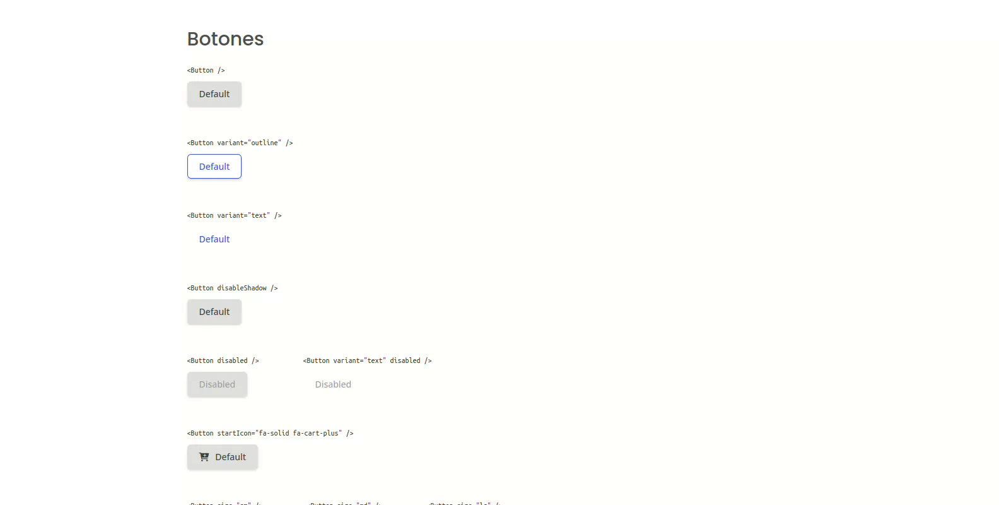
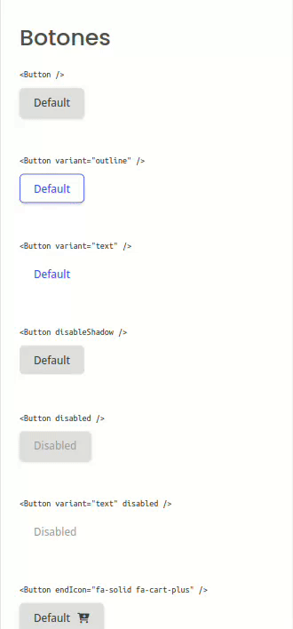

<!-- Please update value in the {}  -->

<h1 align="center">Componente de botón | Button component</h1>

<div align="center">
  Solución para un desafío de <a href="https://devchallenges.io" target="_blank">Devchallenges.io</a>. | Solution for a challenge from  <a href="https://devchallenges.io" target="_blank">Devchallenges.io</a>.
</div>

<div align="center">
  <h3>
    <a href="https://javiervaleriano.github.io/reusable-button-component">
      Demo
    </a>
    <span> | </span>
    <a href="https://devchallenges.io/solutions/U0syZjP9I1tfSOZnNtzd">
      Solución / Solution
    </a>
    <span> | </span>
    <a href="https://devchallenges.io/challenges/ohgVTyJCbm5OZyTB2gNY">
      Desafío | Challenge
    </a>
  </h3>
</div>

<!-- TABLE OF CONTENTS -->

## Table of Contents

- [Visión general | Overview](#visi%C3%B3n-general--overview)
  - [Construido con | Built With](#construido-con--built-with)
- [Características | Features](#caracter%C3%ADsticas--features)
- [Cómo usar | How to use](#c%C3%B3mo-usar--how-to-use)
- [Contacto | Contact](#contacto--contact)

<!-- OVERVIEW -->

## Visión general | Overview

### Escritorio | Desktop



### Móvil | Mobile



**lang="es"**: Hola, persona que está viendo mi proyecto. Aquí puedes ver <a href="https://javiervaleriano.github.io/reusable-button-component" target="_blank">la demo de mi solución</a>. Este desafío fue una buena experiencia para empezar a aplicar los conocimientos del desarrollo front-end con librerías y empezar a conocer cómo puede funcionar la reutilización de componentes a nivel de código.

Justamente, este proyecto me ayudó a mejorar mi capacidad de reutilizar componentes y de qué forma, aparte de mantener los estilos de cada componente bien definidos para que no existan confusiones. Literalmente solo hay un componente de botón definido en el código.

**lang="en"**: Hello, person who is viewing my project. Here you can see <a href="https://javiervaleriano.github.io/reusable-button-component" target="_blank">the demo of my solution</a>. This challenge was a good experience to start applying the knowledge of front-end development with libraries and start to know how component reuse can work at code level.

Precisely, this project helped me to improve my ability to reuse components and in what way, apart from keeping the styles of each component well defined so that there is no confusion. There is literally only one button component defined in the code.

### Construido con | Built With

<!-- This section should list any major frameworks that you built your project using. Here are a few examples.-->

- [React](https://reactjs.org/)

## Características | Features

<!-- List the features of your application or follow the template. Don't share the figma file here :) -->

**lang="es"**: Esta aplicación/sitio se creó como una entrega a un desafío de [Devchallenges](https://devchallenges.io/challenges). El [desafío](https://devchallenges.io/challenges/ohgVTyJCbm5OZyTB2gNY) fue crear una página para completar las historias de usuario dadas:

**lang="en"**: This application/site was created as a submission to a [DevChallenges](https://devchallenges.io/challenges) challenge. The [challenge](https://devchallenges.io/challenges/ohgVTyJCbm5OZyTB2gNY) was to build a page to complete the given user stories.

- User story: Puedo ver diferentes tipos de botones: default, outline y text | I can see different button types: default, outline and text

- User story: Puedo elegir deshabilitar la sombra | I can choose to disable box-shadow

- User story: Puedo elegir deshabilitar el botón | I can choose to disable the button

- User story: Puedo elegir tener un ícono a la izquierda o a la derecha | I can choose to have an icon on the left or right

- User story: Puedo tener diferentes tamaños de botones | I can have different button sizes

- User story: Puedo tener colores diferentes | I can have different colors

- User story: Cuando paso por encima o enfoco el botón, puedo ver indicadores visuales | When I hover or focus, I can see visual indicators

- User story: Aún puedo acceder a todos los atributos del botón | I can still access all button attributes.

## Cómo usar | How To Use

<!-- This is an example, please update according to your application -->

**lang="es"**: Para clonar y ejecutar esta aplicación, necesitarás [Git](https://git-scm.com) y [Node.js](https://nodejs.org/en/download/) (que viene con [npm](https://www.npmjs.com)) instalados en tu ordenador. Desde tu línea de comandos:

```bash
# Clone this repository
$ git clone https://github.com/your-user-name/your-project-name

# Install dependencies
$ npm install

# Run the app
$ npm start
```

**lang="en"**: To clone and run this application, you'll need [Git](https://git-scm.com) and [Node.js](https://nodejs.org/en/download/) (which comes with [npm](https://www.npmjs.com)) installed on your computer. From your command line:

```bash
# Clone this repository
$ git clone https://github.com/your-user-name/your-project-name

# Install dependencies
$ npm install

# Run the app
$ npm start
```

## Contacto | Contact

- [Sitio web | Website](https://javiervaleriano.github.io/javiervaleriano-portfolio)
- Codepen [@javiervaleriano](https://codepen.io/javiervaleriano)
- [Devchallenges.io](https://devchallenges.io/portfolio/javiervaleriano)
- GitHub [@javiervaleriano](https://github.com/javiervaleriano)
- Twitter [@javaleriano2](https://twitter.com/javaleriano2)
